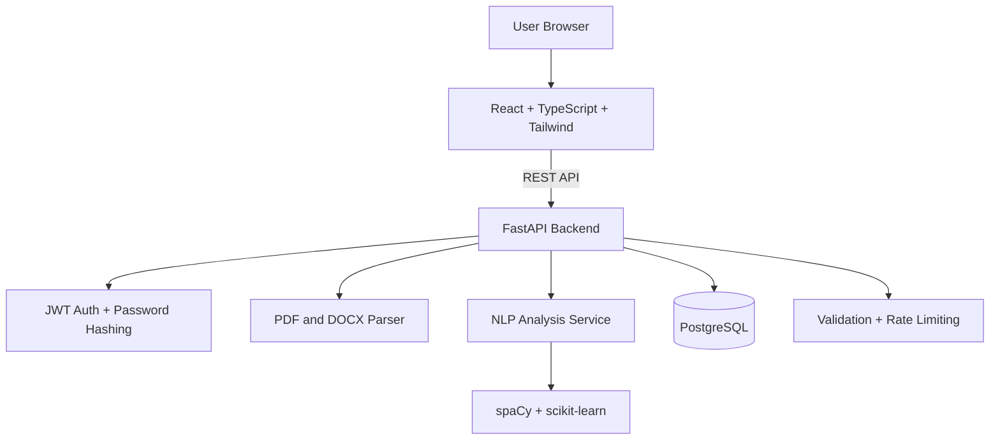

# AI Resume Analyzer Platform

A production-grade, AI-powered full-stack platform that analyzes resumes, extracts skills, matches them with job descriptions, and generates actionable improvement suggestions.

[](./frontend)
[](./backend)
[](#database-model)
[](./docker-compose.yml)
[](./backend/tests)

## Table of Contents

- [Overview](#overview)
- [Core Features](#core-features)
- [Architecture](#architecture)
- [Tech Stack](#tech-stack)
- [Project Structure](#project-structure)
- [API Endpoints](#api-endpoints)
- [Database Model](#database-model)
- [Environment Variables](#environment-variables)
- [Quick Start (Docker)](#quick-start-docker)
- [Local Development](#local-development)
- [Testing and Code Quality](#testing-and-code-quality)
- [Deployment](#deployment)
- [Production Notes](#production-notes)

## Overview

AI Resume Analyzer Platform helps candidates and teams quickly evaluate resume quality against specific job requirements.

It provides:
- Resume score out of 100
- Skill extraction and keyword coverage
- Missing skill detection
- Job-fit match percentage
- Improvement suggestions with weak-area highlighting

## Core Features

### Authentication
- User signup and login
- JWT-based session auth
- Secure password hashing with `passlib` + `bcrypt`

### Resume Processing
- Upload resume in `.pdf` or `.docx`
- File type and file size validation
- Text extraction from uploaded resumes

### AI Analysis
- Skill extraction using NLP and curated technical-skill vocabulary
- Keyword matching against job description
- Semantic similarity scoring using TF-IDF + cosine similarity
- Missing skill detection and tailored recommendations
- Composite resume scoring engine with section-level breakdown

### Dashboard and UX
- Landing page, login, signup
- User dashboard with upload history
- Resume upload and analysis workflow
- Analysis result page with score cards and charts

### Security and Reliability
- Request payload validation using Pydantic
- User-scoped data access
- API rate-limiting middleware
- Containerized stack with PostgreSQL + FastAPI + React

## Architecture



## Tech Stack

| Layer | Stack |
|---|---|
| Frontend | React, TypeScript, Tailwind CSS, Vite, Axios, Recharts |
| Backend | FastAPI, SQLAlchemy ORM, Pydantic, JWT (`python-jose`) |
| AI/NLP | spaCy, scikit-learn |
| Database | PostgreSQL |
| File Parsing | PyPDF, python-docx |
| Testing | Pytest |
| Code Quality | ESLint, Prettier, Black |
| DevOps | Docker, Docker Compose, Nginx |

## Project Structure

```text
AI Resume Analyzer Platform/
|-- backend/
|   |-- app/
|   |   |-- controllers/
|   |   |-- routes/
|   |   |-- services/
|   |   |-- models/
|   |   |-- schemas/
|   |   |-- utils/
|   |   |-- middlewares/
|   |   |-- core/
|   |   `-- main.py
|   |-- tests/
|   |-- requirements.txt
|   |-- Dockerfile
|   |-- pyproject.toml
|   `-- .env.example
|-- frontend/
|   |-- src/
|   |   |-- components/
|   |   |-- pages/
|   |   |-- hooks/
|   |   |-- services/
|   |   |-- store/
|   |   |-- types/
|   |   `-- utils/
|   |-- package.json
|   |-- Dockerfile
|   |-- nginx.conf
|   `-- .env.example
|-- docker-compose.yml
|-- .env.example
`-- README.md
```

## API Endpoints

### Auth

| Method | Endpoint | Description |
|---|---|---|
| POST | `/api/auth/register` | Register user and return JWT token |
| POST | `/api/auth/login` | Login user and return JWT token |

### Resume

| Method | Endpoint | Description |
|---|---|---|
| POST | `/api/resume/upload` | Upload PDF/DOCX resume |
| GET | `/api/resume/history` | Get user upload history |

### Analysis

| Method | Endpoint | Description |
|---|---|---|
| POST | `/api/analyze` | Analyze resume against job description |
| GET | `/api/results/{id}` | Fetch specific analysis result |

OpenAPI docs after backend start:
- `http://localhost:8000/docs`

## Database Model

### Tables

| Table | Purpose |
|---|---|
| `users` | User profile and auth identity |
| `resumes` | Resume metadata + extracted text |
| `job_descriptions` | Job description text entered by user |
| `analysis_results` | Match score, resume score, skills, suggestions |

### Relationships
- `users` -> one-to-many -> `resumes`
- `users` -> one-to-many -> `job_descriptions`
- `users` -> one-to-many -> `analysis_results`
- `resumes` -> one-to-many -> `analysis_results`
- `job_descriptions` -> one-to-many -> `analysis_results`

## Environment Variables

### Backend (`backend/.env`)

| Variable | Description | Example |
|---|---|---|
| `PROJECT_NAME` | Application name | `AI Resume Analyzer Platform` |
| `API_PREFIX` | API prefix | `/api` |
| `SECRET_KEY` | JWT secret key | `change-this-secret` |
| `ACCESS_TOKEN_EXPIRE_MINUTES` | Token expiration in minutes | `60` |
| `DATABASE_URL` | SQLAlchemy DB URL | `postgresql+psycopg2://postgres:postgres@db:5432/resume_analyzer` |
| `MAX_UPLOAD_SIZE_MB` | Max file upload size | `5` |
| `ALLOWED_FILE_EXTENSIONS` | Allowed extensions | `.pdf,.docx` |
| `RATE_LIMIT_REQUESTS` | Request cap per window | `60` |
| `RATE_LIMIT_WINDOW_SECONDS` | Rate-limit window size | `60` |

### Frontend (`frontend/.env`)

| Variable | Description | Example |
|---|---|---|
| `VITE_API_BASE_URL` | Backend API base URL | `http://localhost:8000/api` |

## Quick Start (Docker)

### 1) Run full stack

```powershell
cd "d:\AI Resume Analyzer Platform"
docker compose up --build
```

### 2) Access services
- Frontend: `http://localhost:3000`
- Backend: `http://localhost:8000`
- Swagger: `http://localhost:8000/docs`
- PostgreSQL (host mapping): `localhost:5433`

### 3) Stop stack

```powershell
docker compose down
```

## Local Development

### Backend (PowerShell)

```powershell
cd "d:\AI Resume Analyzer Platform\backend"
python -m venv .venv
.\.venv\Scripts\Activate.ps1
pip install -r requirements.txt
Copy-Item .env.example .env -Force
uvicorn app.main:app --reload --host 0.0.0.0 --port 8000
```

### Frontend (PowerShell)

```powershell
cd "d:\AI Resume Analyzer Platform\frontend"
npm install
Copy-Item .env.example .env -Force
npm run dev
```

Frontend dev URL:
- `http://localhost:5173`

## Testing and Code Quality

### Backend

```powershell
cd "d:\AI Resume Analyzer Platform\backend"
python -m pytest
black app tests
```

### Frontend

```powershell
cd "d:\AI Resume Analyzer Platform\frontend"
npm run lint
npm run format
npm run build
```

## Deployment

### Render
1. Create PostgreSQL service.
2. Deploy backend (`backend/`) as Web Service.
3. Set backend env vars.
4. Deploy frontend (`frontend/`) as Static Site.
5. Point `VITE_API_BASE_URL` to backend public URL.

### Railway
1. Create project and attach PostgreSQL.
2. Deploy backend service from `backend/`.
3. Deploy frontend service from `frontend/`.
4. Configure frontend API base URL.

### AWS (Optional)
1. Push backend/frontend images to ECR.
2. Deploy via ECS Fargate.
3. Use RDS PostgreSQL.
4. Configure ALB + HTTPS with ACM.
5. Store secrets in SSM or Secrets Manager.

## Production Notes

- Replace `SECRET_KEY` before production deployment.
- Restrict CORS origins to trusted frontend domain(s).
- Move in-memory rate-limiter to Redis for distributed scaling.
- Add Alembic migrations for schema lifecycle management.
- Add centralized logging and metrics (CloudWatch/Grafana/Datadog).
- spaCy `en_core_web_sm` is optional; app gracefully falls back to `spacy.blank("en")`.

---

This README intentionally does not include screenshots.
