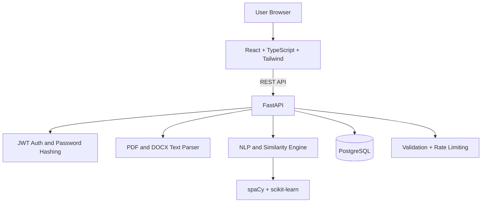

<div align="center">

# AI Resume Analyzer Platform

### Production-grade AI Resume Analysis SaaS (Full Stack)

Analyze resumes, extract skills, match against job descriptions, and generate high-impact improvement suggestions.

<p>
  <a href="./frontend"></a>
  <a href="./backend"></a>
  <a href="#database-design"></a>
  <a href="./docker-compose.yml"></a>
  <a href="./backend/tests"></a>
</p>

<p>
  <a href="#quick-start">Quick Start</a> •
  <a href="#ui-pages-and-user-flow">UI Flow</a> •
  <a href="#api-endpoints">API</a> •
  <a href="#deployment">Deployment</a>
</p>

</div>

---

## Product Vision

This platform gives users a complete, modern workflow:
- Upload resume (`PDF`/`DOCX`)
- Paste target job description
- Get match percentage and score out of 100
- Identify missing skills
- Receive practical suggestions to improve resume quality

It is built with production-minded architecture, clean code separation, and containerized deployment.

---

## Experience Design (Frontend Style)

<table>
  <tr>
    <td width="33%">
      <h3>Landing</h3>
      <p>Clear value proposition, product intro, and direct CTA to sign up/login.</p>
    </td>
    <td width="33%">
      <h3>Dashboard</h3>
      <p>Central workspace with upload history and analysis workflow entry point.</p>
    </td>
    <td width="33%">
      <h3>Analysis Report</h3>
      <p>Score cards, match percentage, skill chips, missing skills, and chart-driven breakdown.</p>
    </td>
  </tr>
</table>

### UI Highlights
- Professional card-based layout
- Route-protected authenticated sections
- Inline loading/error states
- Responsive structure for desktop and mobile
- Chart-powered score visualization using `Recharts`

---

## UI Pages and User Flow

| Page | Route | Access | Purpose |
|---|---|---|---|
| Landing | `/` | Public | Product intro and CTA |
| Login | `/login` | Public | User authentication |
| Signup | `/signup` | Public | New account registration |
| Dashboard | `/dashboard` | Protected | Upload history and workflow summary |
| Upload | `/upload` | Protected | Resume upload + JD input |
| Analysis Result | `/analysis/:id` | Protected | Final analysis report |

### End-to-End User Journey
1. User signs up or logs in.
2. User uploads resume (`.pdf` or `.docx`).
3. User enters job title and job description.
4. System runs NLP + similarity analysis.
5. User gets score, skills, missing skills, and recommendations.

---

## Core Features

### Authentication
- User registration and login
- JWT-based authorization
- Secure password hashing (`passlib + bcrypt`)

### Resume Processing
- File upload (`PDF` and `DOCX`)
- Strict file extension and size validation
- Resume text extraction pipeline

### AI / NLP Analysis
- Skill extraction (curated skill lexicon + NLP)
- Keyword matching
- TF-IDF + cosine similarity scoring
- Missing skill detection
- Improvement recommendation generation
- Composite resume score out of 100 with section breakdown

### Dashboard and Insights
- User-specific resume history
- Result persistence in database
- Visual score breakdown chart

### Security
- Request validation with Pydantic
- JWT middleware/dependencies
- User-scoped data access
- Rate limiting middleware

---

## Architecture



---

## Tech Stack

| Layer | Technologies |
|---|---|
| Frontend | React, TypeScript, Tailwind CSS, Vite, Axios, Recharts |
| Backend | FastAPI, SQLAlchemy ORM, Pydantic, python-jose, passlib |
| AI/NLP | spaCy, scikit-learn |
| Database | PostgreSQL |
| File Parsing | PyPDF, python-docx |
| Testing | Pytest |
| Code Quality | ESLint, Prettier, Black |
| DevOps | Docker, Docker Compose, Nginx |

---

## Project Structure

```text
AI Resume Analyzer Platform/
|-- backend/
|   |-- app/
|   |   |-- controllers/
|   |   |-- routes/
|   |   |-- services/
|   |   |-- models/
|   |   |-- schemas/
|   |   |-- utils/
|   |   |-- middlewares/
|   |   |-- core/
|   |   `-- main.py
|   |-- tests/
|   |-- requirements.txt
|   |-- Dockerfile
|   |-- pyproject.toml
|   `-- .env.example
|-- frontend/
|   |-- src/
|   |   |-- components/
|   |   |-- pages/
|   |   |-- hooks/
|   |   |-- services/
|   |   |-- store/
|   |   |-- types/
|   |   `-- utils/
|   |-- package.json
|   |-- Dockerfile
|   |-- nginx.conf
|   `-- .env.example
|-- docker-compose.yml
|-- .env.example
`-- README.md
```

---

## API Endpoints

### Auth
| Method | Endpoint | Description |
|---|---|---|
| POST | `/api/auth/register` | Register user and return JWT token |
| POST | `/api/auth/login` | Login user and return JWT token |

### Resume
| Method | Endpoint | Description |
|---|---|---|
| POST | `/api/resume/upload` | Upload resume file |
| GET | `/api/resume/history` | Retrieve user upload history |

### Analysis
| Method | Endpoint | Description |
|---|---|---|
| POST | `/api/analyze` | Analyze resume against job description |
| GET | `/api/results/{id}` | Get analysis result details |

OpenAPI docs:
- `http://localhost:8000/docs`

---

## Database Design

| Table | Purpose |
|---|---|
| `users` | User identity and auth |
| `resumes` | Resume metadata + extracted text |
| `job_descriptions` | Stored job descriptions |
| `analysis_results` | Scores, skills, suggestions, breakdown |

Relationships:
- `users` -> many `resumes`
- `users` -> many `job_descriptions`
- `users` -> many `analysis_results`
- `resumes` -> many `analysis_results`
- `job_descriptions` -> many `analysis_results`

---

## Environment Variables

### Backend (`backend/.env`)

| Variable | Description | Example |
|---|---|---|
| `PROJECT_NAME` | App name | `AI Resume Analyzer Platform` |
| `API_PREFIX` | API prefix | `/api` |
| `SECRET_KEY` | JWT secret | `change-this-secret` |
| `ACCESS_TOKEN_EXPIRE_MINUTES` | Token expiry | `60` |
| `DATABASE_URL` | SQLAlchemy DB URL | `postgresql+psycopg2://postgres:postgres@db:5432/resume_analyzer` |
| `MAX_UPLOAD_SIZE_MB` | Max upload size | `5` |
| `ALLOWED_FILE_EXTENSIONS` | Allowed resume formats | `.pdf,.docx` |
| `RATE_LIMIT_REQUESTS` | Request cap | `60` |
| `RATE_LIMIT_WINDOW_SECONDS` | Window duration | `60` |

### Frontend (`frontend/.env`)

| Variable | Description | Example |
|---|---|---|
| `VITE_API_BASE_URL` | Backend API base URL | `http://localhost:8000/api` |

---

## Quick Start

### Docker (Recommended)

```powershell
cd "d:\AI Resume Analyzer Platform"
docker compose up --build
```

Services:
- Frontend: `http://localhost:3000`
- Backend: `http://localhost:8000`
- Swagger: `http://localhost:8000/docs`
- PostgreSQL host port: `5433`

Stop:

```powershell
docker compose down
```

---

## Local Development

### Backend

```powershell
cd "d:\AI Resume Analyzer Platform\backend"
python -m venv .venv
.\.venv\Scripts\Activate.ps1
pip install -r requirements.txt
Copy-Item .env.example .env -Force
uvicorn app.main:app --reload --host 0.0.0.0 --port 8000
```

### Frontend

```powershell
cd "d:\AI Resume Analyzer Platform\frontend"
npm install
Copy-Item .env.example .env -Force
npm run dev
```

Dev UI URL:
- `http://localhost:5173`

---

## Testing and Quality

### Backend

```powershell
cd "d:\AI Resume Analyzer Platform\backend"
python -m pytest
black app tests
```

### Frontend

```powershell
cd "d:\AI Resume Analyzer Platform\frontend"
npm run lint
npm run format
npm run build
```

---

## Deployment

### Render
1. Provision PostgreSQL.
2. Deploy backend (`backend/`) as Web Service.
3. Configure backend env vars.
4. Deploy frontend (`frontend/`) as Static Site.
5. Set `VITE_API_BASE_URL` to backend URL.

### Railway
1. Create project and add PostgreSQL.
2. Deploy backend service from `backend/`.
3. Deploy frontend from `frontend/`.
4. Configure API base URL in frontend env.

### AWS (Optional)
1. Push images to ECR.
2. Deploy backend/frontend on ECS Fargate.
3. Use RDS PostgreSQL.
4. Configure ALB + HTTPS (ACM).
5. Store secrets in Secrets Manager / SSM.

---

## Production Notes

- Replace `SECRET_KEY` in production.
- Restrict CORS to trusted domains.
- Use Redis-based distributed rate limiting for scale.
- Add Alembic migrations for schema lifecycle.
- Add monitoring/logging and CI/CD pipeline.
- `en_core_web_sm` is optional; fallback to `spacy.blank("en")` is implemented.

---

This README is intentionally designed in a frontend-style visual layout and does not include screenshots.
