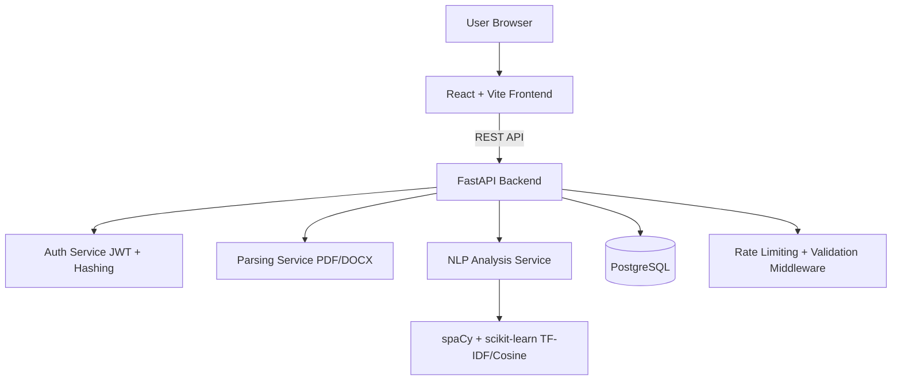

# AI Resume Analyzer Platform

Production-ready AI-powered full-stack platform to upload resumes, extract skills, compare against job descriptions, and generate actionable improvement recommendations.

## Project Overview

This platform provides:
- Secure JWT authentication
- Resume upload (PDF/DOCX)
- NLP-driven skill extraction
- Job description matching with similarity scoring
- Missing skill detection
- Resume scoring out of 100 with score breakdown
- User dashboard with upload history
- Modern frontend with visual analytics

## Architecture Diagram



## Tech Stack

- Frontend: React, TypeScript, Tailwind CSS, Vite, Axios, Recharts
- Backend: FastAPI, SQLAlchemy ORM, JWT (`python-jose`), Passlib
- AI/NLP: spaCy, scikit-learn
- Database: PostgreSQL
- File Processing: PyPDF, python-docx
- Testing: Pytest
- Code Quality: ESLint, Prettier, Black
- DevOps: Docker, Docker Compose

## Complete Project Structure

```text
AI Resume Analyzer Platform/
|-- backend/
|   |-- app/
|   |   |-- controllers/
|   |   |-- routes/
|   |   |-- services/
|   |   |-- models/
|   |   |-- schemas/
|   |   |-- utils/
|   |   |-- middlewares/
|   |   |-- core/
|   |   `-- main.py
|   |-- tests/
|   |-- Dockerfile
|   |-- requirements.txt
|   |-- .env.example
|   `-- pyproject.toml
|-- frontend/
|   |-- src/
|   |   |-- components/
|   |   |-- pages/
|   |   |-- hooks/
|   |   |-- services/
|   |   |-- store/
|   |   |-- types/
|   |   `-- utils/
|   |-- Dockerfile
|   |-- nginx.conf
|   |-- package.json
|   `-- .env.example
|-- docker-compose.yml
|-- .env.example
`-- README.md
```

## Local Installation Guide

### 1) Backend Setup

```bash
cd backend
pip install -r requirements.txt
cp .env.example .env
uvicorn app.main:app --reload --host 0.0.0.0 --port 8000
```

Backend API docs:
- Swagger: `http://localhost:8000/docs`
- Health: `http://localhost:8000/health`

### 2) Frontend Setup

```bash
cd frontend
npm install
cp .env.example .env
npm run dev
```

Frontend URL:
- `http://localhost:5173`

## Environment Variables

### Backend (`backend/.env`)

| Variable | Description | Example |
|---|---|---|
| `PROJECT_NAME` | App name | `AI Resume Analyzer Platform` |
| `API_PREFIX` | Global API prefix | `/api` |
| `SECRET_KEY` | JWT signing key | `change-this-secret` |
| `ACCESS_TOKEN_EXPIRE_MINUTES` | JWT expiry in minutes | `60` |
| `DATABASE_URL` | SQLAlchemy DB URL | `postgresql+psycopg2://postgres:postgres@db:5432/resume_analyzer` |
| `MAX_UPLOAD_SIZE_MB` | Max resume upload size | `5` |
| `ALLOWED_FILE_EXTENSIONS` | Allowed types | `.pdf,.docx` |
| `RATE_LIMIT_REQUESTS` | Max requests per window | `60` |
| `RATE_LIMIT_WINDOW_SECONDS` | Window duration | `60` |

### Frontend (`frontend/.env`)

| Variable | Description | Example |
|---|---|---|
| `VITE_API_BASE_URL` | Backend API base URL | `http://localhost:8000/api` |

## Database Design

### Tables
- `users`
  - one-to-many with `resumes`
  - one-to-many with `job_descriptions`
  - one-to-many with `analysis_results`
- `resumes`
  - stores metadata + extracted text
- `job_descriptions`
  - stores user-submitted target role description
- `analysis_results`
  - stores score, match percentage, detected/missing skills, suggestions

## API Documentation

### Authentication
- `POST /api/auth/register`
  - Body: `email`, `full_name`, `password`
  - Returns JWT + user profile
- `POST /api/auth/login`
  - Body: `email`, `password`
  - Returns JWT + user profile

### Resume
- `POST /api/resume/upload`
  - Multipart: `file` (`.pdf`/`.docx`)
  - Requires Bearer token
  - Extracts and stores raw text
- `GET /api/resume/history`
  - Requires Bearer token
  - Returns upload history

### Analysis
- `POST /api/analyze`
  - Body: `resume_id`, `job_title`, `job_description`
  - Requires Bearer token
  - Returns:
    - resume score
    - match percentage
    - skills detected
    - missing skills
    - suggestions
    - score breakdown
- `GET /api/results/{id}`
  - Requires Bearer token
  - Returns full analysis record

## AI Analysis Modules

Implemented modules:
- Skill extraction (rule + NLP assisted)
- Keyword matching
- TF-IDF semantic similarity scoring
- Missing skill detection
- Resume scoring engine + section-based suggestions

## Security Features

- Input validation with Pydantic
- JWT auth middleware/dependency
- Password hashing with Passlib + bcrypt
- File type and size validation
- API rate limiting middleware
- User-scoped access to resumes and analysis results

## Testing

Run backend tests:

```bash
cd backend
python -m pytest
```

Current coverage includes:
- Authentication flows
- Resume upload and history
- Resume analysis and result retrieval

## Docker Configuration

### Start Full Stack

```bash
docker compose up --build -d
```

### Services
- Frontend: `http://localhost:3000`
- Backend: `http://localhost:8000`
- PostgreSQL: `localhost:5432`

### Stop

```bash
docker compose down
```

## Deployment Instructions

### Render
1. Create PostgreSQL database service on Render.
2. Deploy backend as a Web Service from `backend/`.
3. Set backend env vars (`DATABASE_URL`, `SECRET_KEY`, etc.).
4. Deploy frontend as a Static Site from `frontend/`.
5. Set `VITE_API_BASE_URL` to backend public API URL.

### Railway
1. Create new Railway project.
2. Add PostgreSQL plugin.
3. Deploy backend service from `backend/` and map env vars.
4. Deploy frontend service from `frontend/`.
5. Configure frontend env variable to Railway backend URL.

### AWS (Optional)
1. Push Docker images to ECR.
2. Deploy backend/frontend containers via ECS Fargate.
3. Use RDS PostgreSQL for persistence.
4. Attach ALB + HTTPS (ACM).
5. Store secrets in AWS Secrets Manager/SSM.

## Code Quality Commands

### Backend
```bash
cd backend
black app tests
python -m pytest
```

### Frontend
```bash
cd frontend
npm run lint
npm run format
npm run build
```

## Notes

- spaCy model `en_core_web_sm` is optional. If unavailable, app falls back to `spacy.blank("en")`.
- For production, replace `SECRET_KEY`, tighten CORS, and move rate limiting to Redis-based distributed limiter.
